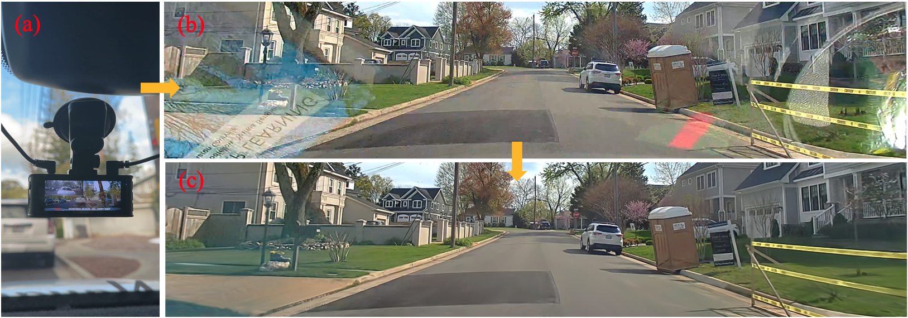
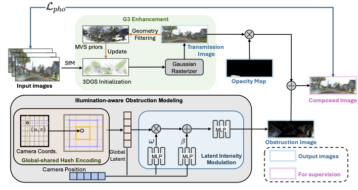

  <h1 align="center">DC-Gaussian: Improving 3D Gaussian Splatting for Reflective Dash Cam Videos</h1>

### [Project Page](https://linhanwang.github.io/dcgaussian/)

## 🖼️ Demo

Given a sequence of video captured by a dash cam that may contain obstructions like reflections and occlusions, DC-Gaussian achieves high-fidelity novel view synthesis getting rid of the obstructions. (a) dash cam; (b) original video frame; (c) novel view rendering with obstruction removal.

## 📖 Abstract
We present DC-Gaussian, a new method for generating novel views from in-vehicle dash cam videos.

While neural rendering techniques have made significant strides in driving scenarios, existing methods are primarily designed for videos collected by autonomous vehicles. However, these videos are limited in both quantity and diversity compared to dash cam videos, which are more widely used across various types of vehicles and capture a broader range of scenarios. Dash cam videos often suffer from severe obstructions such as reflections and occlusions on the windshields, which significantly impede the application of neural rendering techniques. To address this challenge, we develop DC-Gaussian based on the recent real-time neural rendering technique 3D Gaussian Splatting (3DGS). Our approach includes an adaptive image decomposition module to model reflections and occlusions in a unified manner. Additionally, we introduce illumination- aware obstruction modeling to manage reflections and occlusions under varying lighting conditions. Lastly, we employ a geometry-guided Gaussian enhancement strategy to improve rendering details by incorporating additional geometry priors.

Experiments on self-captured and public dash cam videos show that our method not only achieves state-of-the-art performance in novel view synthesis, but also accurately reconstructing captured scenes getting rid of obstructions.

## 🚀 Pipeline

## 🗓️ TODO
- [ ] Relase code
- [ ] Release dataset